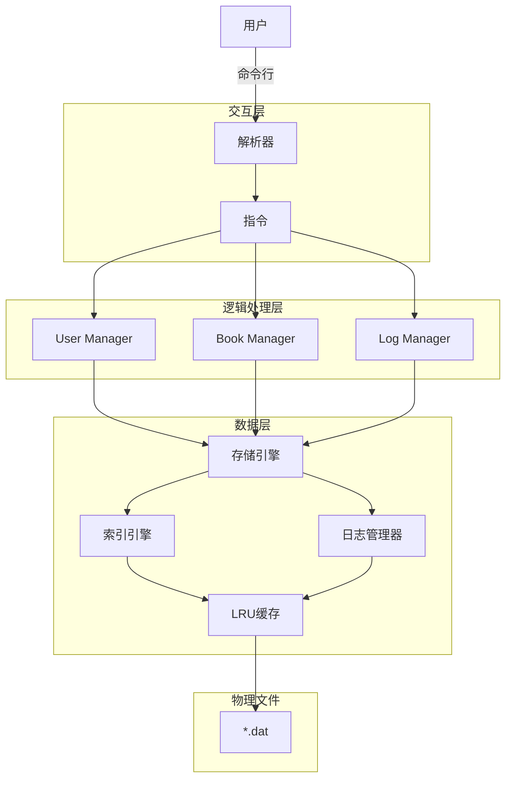

# 总体设计文档

## 概述
本项目旨在实现一个书店系统，该书店系统能够面向顾客、工作员、店长提供书籍的进货、购买、查看等功能，使用命令行进行交互

## 系统架构设计
本项目的架构可以简单概括为三层：交互层、逻辑处理层、数据层

三者关系大概如下图所示：


## 架构详细介绍

### 交互层
* **功能**：接受用户在命令行输入的指令，进行参数的解析以及部分的指令合法性的检验
* **具体实现**：
  * **main.cpp** : 实现接受输入，创建指令对应的命令类并调用
  * **command.cpp** : 采用继承的方式，从Command基类继承出各种指令类，各种指令对参数的合法性进行检验，并调用逻辑实现层的相关函数进行指令的执行

### 逻辑实现层
* **功能**：接受交互层提供的参数，执行交互层输入的，并将相关数据输出到数据层
* **具体实现**：
  * **manager.cpp** : 采用静态成员指针管理了**UserManager、BookManager、LogManager**三个类
    * **UserManager** : 管理用户的登录栈，账户信息的记录以及信息检索，提供账户的增删、登录等处的功能;使用**user_list**记录所有账户信息，**id_user**用于检索，提供用户数据在**user_list**的位置
    * **BookManager** ： 记录书籍信息以及书籍的信息记录，提供进货、修改信息、购买、检索等功能；使用**book_list**记录所有账户信息，**isbn_book, name_book, author_book, key_book**用于检索各种书籍信息，提供书籍数据在**book_list**的位置
    * **LogManager** ： 记录了财务账单以及系统指令，提供展示日志的功能

### 数据层
* **功能** ：记录各种数据、为逻辑实现层提供数据的读取、修改的接口
* **具体实现** ：
  * **model.cpp** : 定义了User、Book、SystemLog、FinanceLog等结构体，明确了各种数据的存储形式;
  * **file_io.hpp & cache.hpp** : 实现了具有缓存、空间回收的文件读取、修改、写入gongneng
  * **unrollindex.hpp**：使用分块链表的算法实现了**User、Book**等数据的部分信息检索整体信息的映射功能

## 模块详细设计

### config
在config.hpp中定义了写需要使用的常数
```
//权限等级
constexpr int VISITOR = 0;
constexpr int CUSTOMER = 1;
constexpr int STAFF = 3;
constexpr int ADMIN = 7;
//分块链表的块大小
constexpr int BlockSize = 1000;
//cache大小
constexpr int CacheSize = 10;
```

### Exception 类
该类用于在指令非法时抛出异常
```
class Exception : public std::exception {
private:
    std::string message;
public:
    explicit Exception(const std::string& msg) : message(msg) {}
    const char* what() const noexcept override {
        return message.c_str();
    }
};
```


### Command类
```
class Command {
protected:
  static UserManager *user_manager_;
  static BookManager *book_manager_;
  static LogManager *log_manager_;
public:
  static void init(UserManager *, BookManager *, LogManager *); //初始化管理各数据的管理器
  virtual const char *Name() const = 0; //提供指令名称便于报错信息
  virtual int NeedPrivilege() const = 0; //确认指令所需权限
  virtual void Execute(const std::vector<std::string> &) = 0; //执行指令
  void run(const std::vector<std::string> &); //判断权限等级
};
```
采用上述Command类，并继承该父类生成具体的如下子类
```
class Exit : public Command //退出系统
class Login : public Command //登入
class Logout : public Command //登出
class Register : public Command //注册账户
class UserAdd : public Command //添加账户
class Passwd : public Command //修改密码
class DeleteUser : public Command //删除账户
class ShowBook : public Command //展示检索结果
class BuyBook : public Command //购买书籍
class SelectBook : public Command //选中书籍
class ModifyBook : public Command //修改书籍信息
class ImportBook : public Command //进货书籍
class ShowFinance : public Command /展示财务记录
class ShowLog : public Command //展示系统日志
class ReportFinance : public Command //展示财务报表
class ReportEmployee : public Command //展示员工工作表
```

### UserManager
```
class UserManager {
private: 
  std::vector<Session> log_stack_; //登录栈的管理
  MemoryRiver<User> user_list_; //记录账户信息
  UnrollIndex<FixedString<30>, int> id_user_; //账户id检索
public:
  UserManager();
  const Session GetTopSession();
  User GetUser(size_t);
  SystemLog Login(std::string, std::string = ""); //登入
  SystemLog Logout(); //登出
  SystemLog Register(std::string, std::string, std::string); //注册账户
  SystemLog UserAdd(std::string, std::string, int, std::string);//添加账户
  SystemLog Passwd(std::string, std::string, std::string = "");//修改密码
  SystemLog Delete(std::string);//删除账户
  void SelectBook(size_t);//账户选择书籍
};
```

### BookManager
```
class BookManager {
private:
  MemoryRiver<Book> book_list_; //记录书籍信息
  UnrollIndex<FixedString<20>, int> isbn_book_; //isbn检索书籍
  UnrollIndex<FixedString<60>, int> name_book_; //书名检索书籍
  UnrollIndex<FixedString<60>, int> author_book_; //作者检索书籍
  UnrollIndex<FixedString<60>, int> key_book_; //关键词检索书籍
public:
  BookManager();
  const Book GetBook(size_t); //提供对应book_list位置记录的信息
  int UnrollIsbn(std::string); //检索isbn，若没有则创建该isbn的书籍
  SystemLog Buy(std::string, int); //购买 
  SystemLog Modify(size_t, const std::string []); //修改信息
  SystemLog Import(size_t, int); //进货
  void Show(const std::string []); //展示检索信息
};
```

### LogManager
```
class LogManager {
private:
  MemoryRiver<FinancialLog> finance_log_;
  MemoryRiver<SystemLog> system_log;
public:
  LogManager();
  void ShowFinance(int = -1);
  void ReportFinance();
  void PrintStaff();
  void PrintLog();
  void AddFinancialLog(double);
  void AddSystemLog(SystemLog &);
};
```

### Book
书籍信息记录
```
struct Book {
  char isbn_[21];
  char bookname_[61];
  char author_[61];
  char keyword_[61];
  int quantity_ = 0;
  double price_ = 0;
  double total_cast_ = 0;
  Book() = default;
  Book(const char *);
};
```

### User
用户信息记录
```
struct User {
  int privilege_ = 0;
  char userid_[31];
  char password_[31];
  char username_[31];
  User() = default;
  User(const char *, const char *, const char *, const int);
};
```

### SystemLog
系统日志记录
```
struct SystemLog {
  SystemLog(const char *, const char *, const char *, int, double, const char *);
  SystemLog() = default;
  char userid_[31];
  char action_[30];
  char target_[31];
  int quantity_ = 0;
  double total_amount_ = 0;
  char info_[120];
};
```

### FinanceLog
财务账单记录
```
struct FinanceLog {
  double positive_amount_ = 0;
  double minus_amount_ = 0;
  FinanceLog() = default;
  FinanceLog(double, double);
};
```

### FixedString
存储固定长度的字符串，重载了部分运算符便于操作。用于作为检索信息的Key

### UnrollIndex
使用分块链表记录检索信息，该信息为相关数据在对应的记录表里的位置。
使用模板，便于对各种信息进行检索，其中Key使用FixedString类型
```
void Insert(const Key &key, const Value &value);
bool Delete(const Key &key, const Value &value);
```


