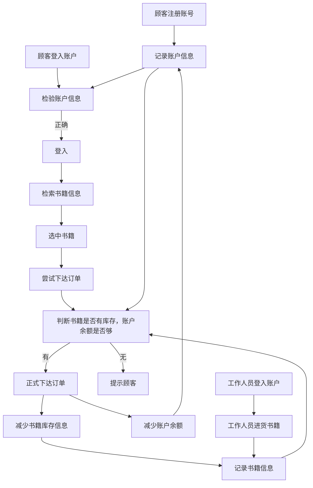
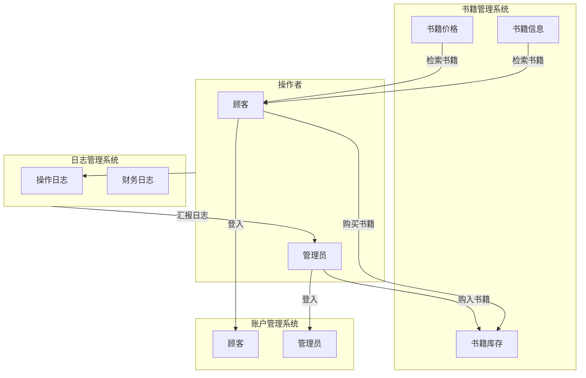

# 需求分析文档

## 项目概述
实现一个用 C++ 语言编写的书店管理系统，用于向店家和顾客提供图书检索与购买相关服务。

## 业务流图


## 数据流图



## 数据词典

* **账户信息**：
  * 账户密码：登入账户所需要的密码，由不超过$20$位的**可见ASCII字符**组成
  * 账户昵称：账户对外显示的名称，由不超过$10$位的**可见ASCII字符**组成
* **书籍信息**：
  * 书籍库存：书店拥有的书籍数量，用一个不超过$2147683647$的**非负整数**表示
  * 书籍价格：书籍的单价，用一个**双精度浮点型数**表示
  * 书籍信息： 包括书籍名称、作者名称、书籍关键字，各由不超过$20$位**可见ASCII字符**组成
* **日志信息**
  * 日志：记录系统相关操作，分为操作者、行为、对象、和详细细节（如书籍的数量、金额；账户的信息等），分别用不超过$10,20,10,50$位的**可见ASCII字符**表示。日志可分为不同类型，如：系统日志、财务日志

## 功能说明
* **账户管理系统**：
  * 注册账户
    * 名字：Register
    * 输入：账户昵称、账户密码
    * 处理：添加账户信息
    * 输出：注册是否成功
  * 注销账户
    * 名字：Delete
    * 输入：账户昵称、账户密码
    * 处理：删除账户信息
    * 输出：注销是否成功
  * 登录账户
    * 名字：Login
    * 输入：账户昵称、账户密码
    * 处理：比对账户信息，修改登录栈
    * 输出：登录是否成功
  * 登出账户
    * 名字：Logout
    * 输入：无
    * 处理：修改登录栈
    * 输出：登出是否成功
  * 充值
    * 名字：Recharge
    * 输入：充值金额
    * 处理：查看登录栈，修改账户信息
    * 输出：充值是否成功
* **书籍管理系统**：
    * 添加书籍
      * 名字：Import
      * 输入：书籍信息（书名、作者……）、书籍单价、数量
      * 处理：添加书籍信息
      * 输出：添加是否成功
    * 购买书籍
      * 名字：Buy
      * 输入：书籍编号、购买数量
      * 处理：查看书籍信息，若符合购买条件则减少相应库存，并减少账户余额
      * 输出：购买是否成功
    * 检索书籍
      * 名字：Show
      * 输入：检索信息
      * 处理：检索
      * 输出：符合检索要求的书籍信息
* **日志管理系统**：
  * 记录日志
    * 名字：AddLog
    * 输入：日志信息
    * 处理：添加日志信息
    * 输出：添加是否成功
  * 输出日志
    * 名字：ShowLog
    * 输入：（日志条数）？（日志类型）？
    * 处理：根据要求输入
    * 输出：日志

## 用户交互设计
采用命令行输入指令、输出相应结果进行交互
* 注册账户
```
register [username] [password] [customer/staff]
```
* 注销账户
```
delete [username] [password]
```
* 登入账户
```
login [username] [password]
```
* 登出账户
```
logout 
```
* 充值
```
recharge [amount]
```
* 添加书籍
```
import [bookid] [bookname] [author] [quantity] [price] [detail]?
```
* 购买书籍
```
buy [bookid] [quantity]
```
* 检索书籍
```
show ([bookid] | [bookname] | [author] | [detail])
```
输出：符合条件的书籍信息
* 输出日志
```
showlog [count]? [type]?
```
输出：所需日志


